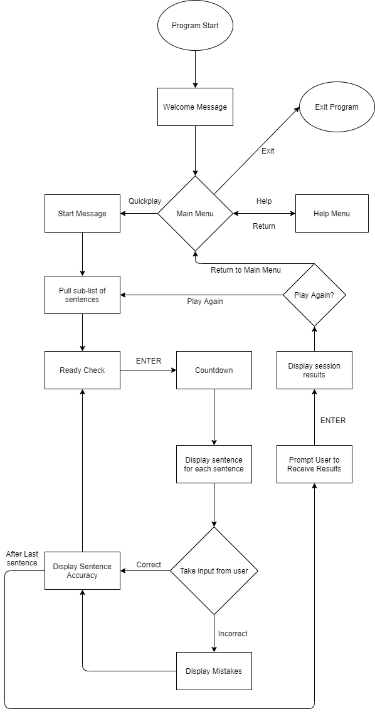
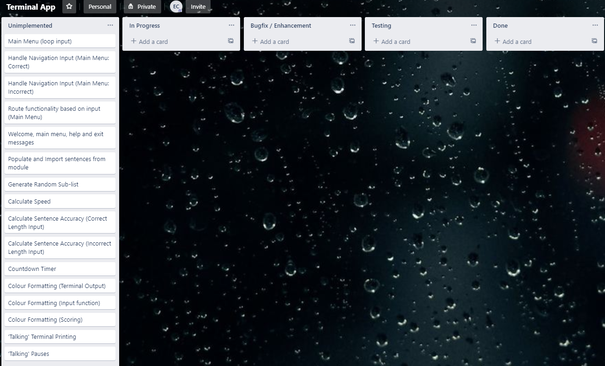
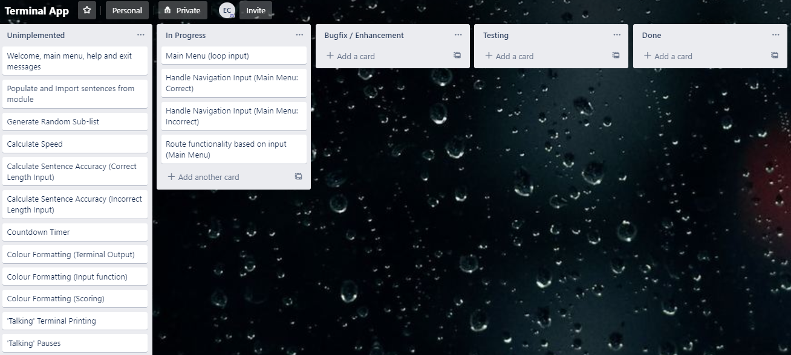
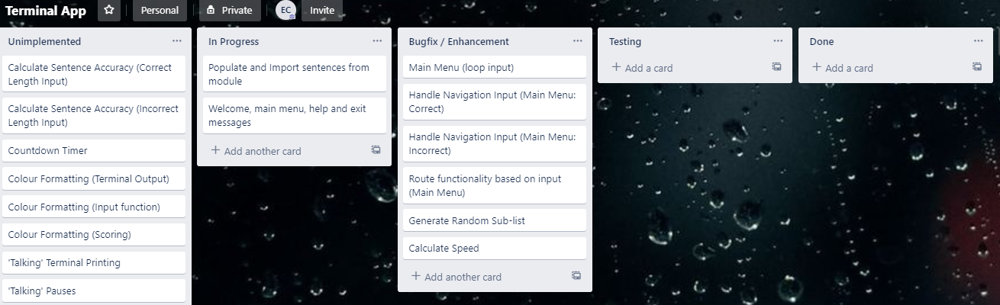
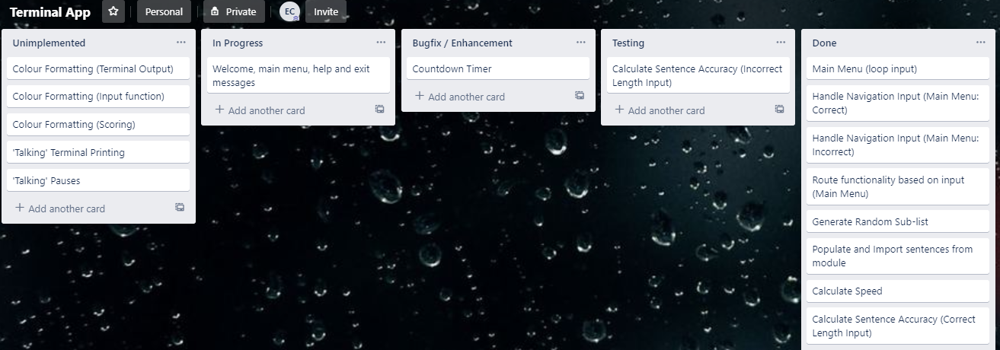
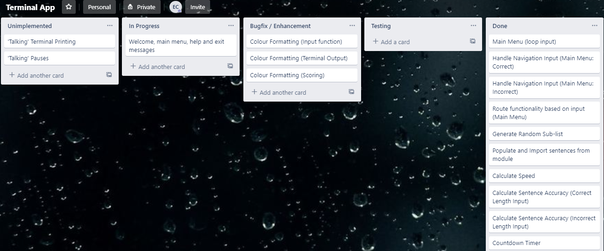
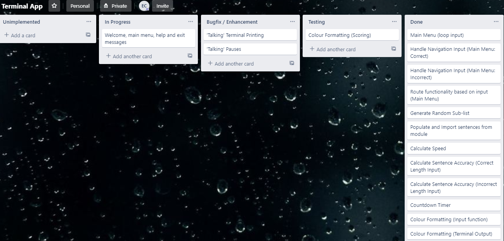
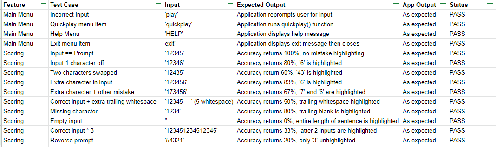

# Terminal Typing Test

---

## About
Terminal Typing Test is a Python Project by Eric Chew for Coder Academy Assessment 3 (Term 1).  

## Installation and Use
Python must be installed on the target machine under */usr/sbin/python*.  

*termcolor* must also be installed on the target machine using:
```bash
pip install termcolor
```  

After unzipping the project, the main program can be run after execution permissions are granted to *main.py* in the *src* directory:
```bash
chmod +x main.py
```  

The three ways to run the program from the terminal are (from the *src* directory):
  * No Arguments (standard use):  
    ```bash
	./main.py
	```
  * With the *--help* Argument (contains a short summary of available in-app commands):  
    ```bash
	./main.py --help
	```
  * With the *--debug* Argument (for testing purposes):  
    ```bash
	./main.py --debug
	```
	
The application can be interacted with entirely from the command line interface. *Cyan* text in the application indicates the user is being prompted for input. 

---

## Statement of Purpose and Scope
This application is a gamified tool in order for people to practise typing the full range of alphabetic characters on a QWERTY keyboard in order for them to improve their typing speed and accuracy.  

The application's core function will:  
  * Choose a number of sentences from a prepopulated module
  * Present them to the user to type
  * Score the user's response based on how quickly and accurately the response was  
  
To smooth the experience, the user will also have access to:
  * A help menu describing how the program works
  * An exit option so the application can be natively ended  
  
As the world becomes increasingly digitised, the proportion of people who spend large percentages of their days using a keyboard has also gone up. In order to most effectively make use of their time at their computers, users should be confident in their abilities with a keyboard. To this end, this application is being developed in order to create a medium over which users can practise their typing and receive feedback along the metrics of speed and correctness as well as help them identify characters that they frequently type incorrectly.  

Hence the target audience of this application is people who spend large parts of their day at their computer for work or leisure (e.g. office workers, students, developers, etc.). During brief 5-10 minutes break periods, users could open up the application to type out a quick gauntlet of pangrams (sentences or phrases that contain each character in the English alphabet). By having to type out every letter, users will be able to practise reaching letters they don't frequently use in their daily lives and will be able to identify if it is a weak point in their typing ability in order for them to begin making  meaningful improvements to the way they type.  

---

## Features  

### Main Menu
The application will have a main menu that will serve as the entry point to the program as well as being the point from which the core functionality (the typing test) and other features will be reachable from.
From the main menu, the user will have access to three menu options:
  1. Quickplay: which starts the main typing test
  2. Help: which provides a summary of the game and how to use it
  3. Exit: closes the app with a farewell message

The menu will only accept these three options; any other inputs will cause the application to respond that the input was invalid and prompt the user to choose again (with a reminder of what the valid menu options are).  

### Scoring
The application will score users based on prompt sentences along two metrics: speed and accuracy.  

For speed timing, a timer will start after a countdown and stop after the user types ENTER to confirm their input. This will occur for each sentence ensuring that the timer only runs while the user is able to enter the sentence. For each sentence, the application will also keep track the number of correctly entered characters as incorrectly entered characters are not considered as part of the user's typing speed. The user's WPM (words per minute) is calculated as:
```
(Total Correct Characters / 5) / Time in minutes
```  

For accuracy scoring, the correct and incorrect characters in the user's input will be taken into consideration and calculated to be the result of:
```
Correct Characters / (Correct Characters + Incorrect Characters) * 100%
```

### Colour Formatting and 'Talking' Terminal
The application will use colour formatting for the following:
  * Improve overall aesthetics
  * Indicate certain meanings
  * Highlight mistakes in user input during core functionality  

Throughout the application the following colours will have these meanings assigned to them:
  * Yellow: Terminal has more text to come
  * Cyan: Terminal is waiting for user input (menus)
  * White: Terminal is waiting for user input (for sentences in core functionality)
  
During the typing test, the program will print mistakes with the following formatting:
  * Green Text: Input matches prompt
  * Red Text: Input is incorrect compared to prompt
  * Red Background: Input is incorrect, but is not a visible character (e.g. white-space or missing character)

Additionally, the application will make use of a 'talking terminal', where printing is done character by character instead of instantaneously to give a 'talking' feel.

---

## User Interaction and Experience

A help menu is available from the main menu that outlines how the user interacts with the application.  

The user will interact with the application entirely through the command line interface using their keyboard when prompted for input.
These interactions will fall under one of the following scenarios:
  1. User is navigating a menu and is expected to enter a menu item
  2. User is responding to a sentence prompt
  3. Application is confirming user is ready by asking them to press ENTER  
  
In the first case, the error handling will cause the application to re-prompt the user for input while reminding them what the available options are.  

In the second case, any and every input is accepted (although it may negatively impact the user's performance).  

In the third case, all input in ignored as the application only cares when the user inputs an ENTER key.  

---

## Control Flow Diagram



---

## Implementation Plan

| Feature | Sub-item | Priority | Due Date |
| --- | --- | :---: | --- |
| Main Menu | Input Loop | 1 | 2020-07-14
| Main Menu | Correct Input | 1 | 2020-07-14
| Main Menu | Incorrect Input | 3 | 2020-07-14
| Main Menu | Navigate to Choice | 2 | 2020-07-14
| Main Menu | Menu Messages | 4 | 2020-07-18
| Scoring | Populate Sentences | 3 | 2020-07-15
| Scoring | Generate Sub-list | 2 | 2020-07-15
| Scoring | Calculate Speed | 1 | 2020-07-15
| Scoring | Calculate Accuracy (correct length) | 1 | 2020-07-16
| Scoring | Calculate Accuracy (incorrect length) | 1 | 2020-07-16
| Scoring | Countdown Timer | 4 | 2020-07-16
| Formatting | Terminal Output | 4 | 2020-07-17
| Formatting | Input Prompts | 4 | 2020-07-17
| Formatting | Scoring/Mistakes | 3 | 2020-07-17
| Formatting | 'Talking' Terminal | 5 | 2020-07-18
| Formatting | 'Talking' Pauses | 5 | 2020-07-18  

  

  

  

  

  

  

  

---

## Test Application

The application was tested manually in debug mode (*./main.py --debug*), which removes all delays and ensures the prompt in the typing test is the string '12345'.

  

